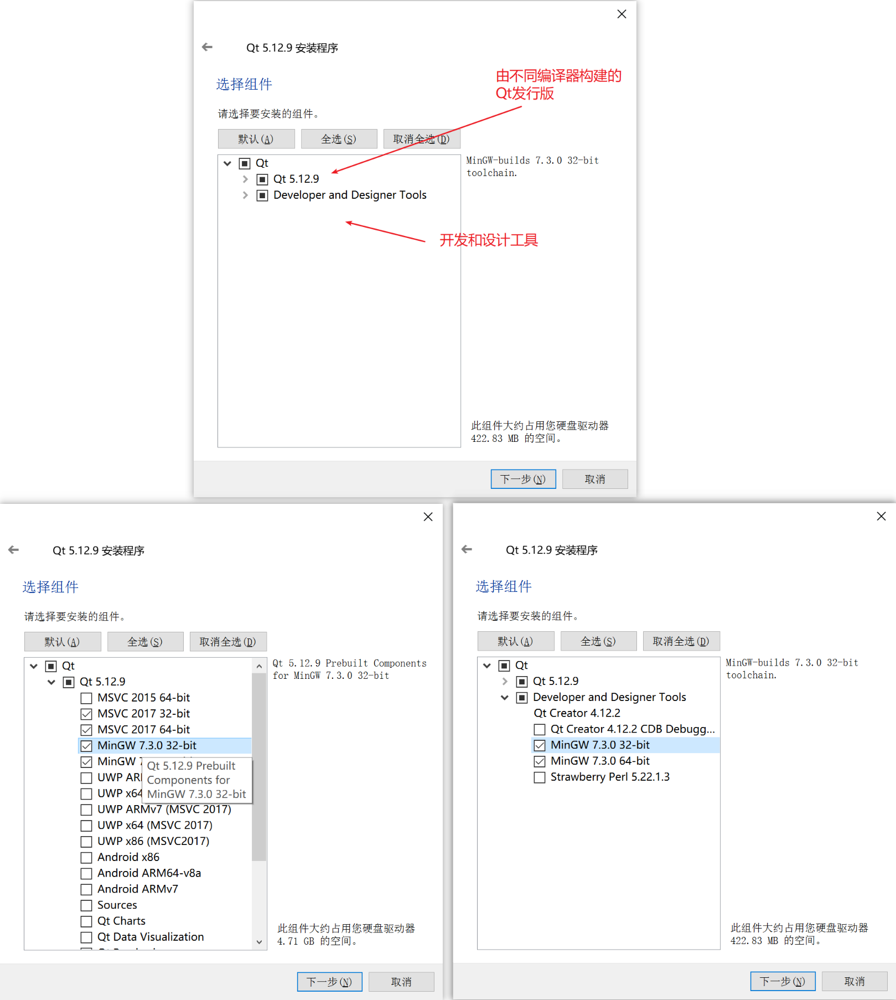
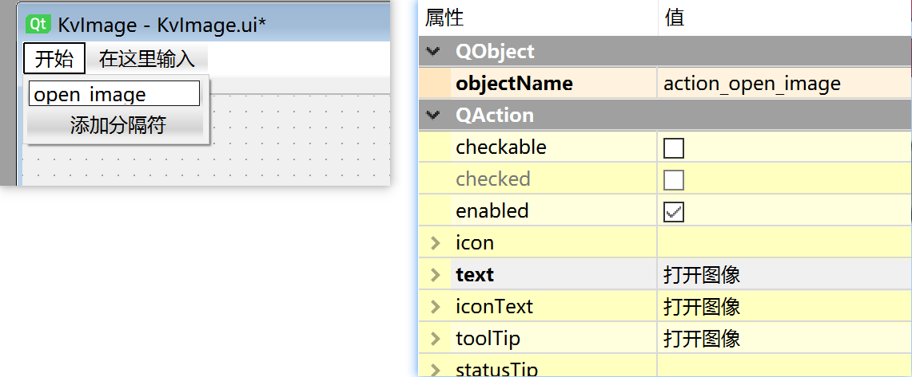

# 从0开始：在VS中使用QT开发图像浏览软件
> date: 2021-04-08 23:11:37
>
> 由于OpenCV的MSVC版本在预览图像时的不便捷性，而QT Creator调试又过于恶心，因此希望基于VS和QT开发一个图像预览的软件，附带一些处理功能。文章记录了从安装到开发的全过程，使用VS2019和QT5.12.9。


# 安装

在这之前我们预装好了VS2019，这部分主要介绍qt的安装、VS插件的安装和编写Hello World程序。

下载地址推荐以下几个：

| 来源                    | 地址                                                |
| ----------------------- | --------------------------------------------------- |
| 官方                    | https://download.qt.io/archive/                     |
| 清华                    | https://mirrors.tuna.tsinghua.edu.cn/qt/archive/    |
| 北理                    | https://mirrors.bit.edu.cn/qtproject/archive/       |
| Geekpie（上海科技大学） | https://mirrors-wan.geekpie.club/qtproject/archive/ |
| 中科大                  | http://mirrors.ustc.edu.cn/qtproject/archive/       |

## Qt的安装

之前下了个[qt-opensource-windows-x86-5.9.0.exe](https://mirrors.tuna.tsinghua.edu.cn/qt/archive/qt/5.9/5.9.0/qt-opensource-windows-x86-5.9.0.exe)，只装了MinGW5.3.0_32版本，在VS2019中无法添加使用，再加上想要试试最新的版本Qt5.12，因此决定把原先Qt和Qt Creator的删掉，重新装一个支持MSVC和MinGW版本的。

在[清华镜像/qt/archive/qt/5.12/5.12.9](https://mirrors.tuna.tsinghua.edu.cn/qt/archive/qt/5.12/5.12.9/)下载[qt-opensource-windows-x86-5.12.9.exe](https://mirrors.tuna.tsinghua.edu.cn/qt/archive/qt/5.12/5.12.9/qt-opensource-windows-x86-5.12.9.exe)，下载后运行程序，一直点击下一步即可完成安装。需要注意的几点：1. 需要有个Qt的账号并验证登录才能继续安装；2. 安装目录可以自定义，可修改至非系统盘；3. 在组件选择中，需要注意区分，在上方的`Qt 5.12.9`中有一个MinGW 7.3.0，下方的`Developer and Designer Tools`中也有一个，它们的区别在于，上方的是Qt通过MinGW 7.3.0编译的发行版（dll, lib, include），而下方的是在Qt Creator中要使用的**应用程序编译和构建工具**。



安装完成后，记住安装目录，进入下一步：在VS2019中引入Qt。

---

（下面是一些版本声明和个人看法）

由于Qt公司的某些原因，5.15及之后版本的Qt不再支持离线安装包（官方声明如下）

> Due to The Qt Company offering changes, open source offline installers are not available any more since Qt 5.15. Read more about offering changes in the https://www.qt.io/blog/qt-offering-changes-2020 blog.
>
> If you need offline installers, please consider our new Qt for Small Business offering: https://www.qt.io/blog/available-now-qt-for-small-businesses
>
> ---
>
> from https://mirrors.tuna.tsinghua.edu.cn/qt/archive/qt/5.15/5.15.0/OFFLINE_README.txt

这里推荐下载离线安装包，可以避免在线安装的代理问题，可以通过国内镜像下载，速度快，稳定性好。

Qt版本的选择有点讲究，之前安装的5.9是一个长期支持版本（LTS），下一个是5.12，接着是5.15。5.9版本于2020年5月停止维护，其中5.9.9算是一个比较稳定的版本，可以使用；5.12是最后一个支持离线安装包的LTS版本的Qt，但是其三年的维护时限将于2021年12月结束，如果需要更新，就不得不使用在线安装的功能；5.15只能通过在线安装的方式获取，但其支持周期或许会更长，也被视为Qt6的过渡版本。不过总的来说，**如果只是为了入门学习Qt的基本特性，或者在实际应用中对软件的需求不发生根本性改变，那么固定使用一个版本会是一个好的选择，5.9.9和5.12.9都是不错的版本。**

| Qt版本 | 持续支持时间          | 依据                                                         |
| ------ | --------------------- | ------------------------------------------------------------ |
| 5.9    | 2017年5月-2020年5月   | https://www.qt.io/blog/support-of-qt-5.9-lts-ends-in-may-2020 |
| 5.12   | 2018年12月-2021年12月 | https://www.qt.io/zh-cn/blog/2018/12/17/qt-5-12-lts-released |
| 5.15   | 2020年6月-2023年6月   | https://www.qt.io/zh-cn/blog/qt-5.15-released                |

## VS插件的安装

VS插件（Qt VS Tools）可以在[清华镜像/qt/archive/vsaddin](https://mirrors.tuna.tsinghua.edu.cn/qt/archive/vsaddin/)下载获得，这边**不推荐安装最新版本**的，经过几次的尝试，发现最新版本的Qt VS Tools插件（2.7.x）安装成功后，添加`qmake.exe`后点击确定，再次进如配置窗口时之前的添加结果就消失了，下面是一个踩坑列表：

| Qt VS Tools版本                                              | 下载路径                                                     | 能否成功添加qmake |
| ------------------------------------------------------------ | ------------------------------------------------------------ | ----------------- |
| [qt-vsaddin-msvc2019-2.7.1.vsix](https://mirrors.tuna.tsinghua.edu.cn/qt/archive/vsaddin/2.7.1/qt-vsaddin-msvc2019-2.7.1.vsix) | https://mirrors.tuna.tsinghua.edu.cn/qt/archive/vsaddin/2.7.1/ | ❌                 |
| [qt-vsaddin-msvc2019-2.7.0.vsix](https://mirrors.tuna.tsinghua.edu.cn/qt/development_releases/vsaddin/2.7.0/qt-vsaddin-msvc2019-2.7.0.vsix) | https://mirrors.tuna.tsinghua.edu.cn/qt/development_releases/vsaddin/2.7.0/ | ❌                 |
| [qt-vsaddin-msvc2019-2.7.0-rev.28.vsix](https://mirrors.tuna.tsinghua.edu.cn/qt/development_releases/vsaddin/2.7.0/qt-vsaddin-msvc2019-2.7.0-rev.28.vsix) | https://mirrors.tuna.tsinghua.edu.cn/qt/development_releases/vsaddin/2.7.0/ | ❌                 |
| [qt-vsaddin-msvc2019-2.4.3.vsix](https://mirrors.tuna.tsinghua.edu.cn/qt/archive/vsaddin/2.4.3/qt-vsaddin-msvc2019-2.4.3.vsix) | https://mirrors.tuna.tsinghua.edu.cn/qt/archive/vsaddin/2.4.3/ | ⭕                 |

最后还是装了一个较老的版本[qt-vsaddin-msvc2019-2.4.3.vsix](https://mirrors.tuna.tsinghua.edu.cn/qt/archive/vsaddin/2.4.3/qt-vsaddin-msvc2019-2.4.3.vsix)。插件下载后双击运行，若电脑上已安装VS2019，则直接按照提示安装即可。安装完成后，打开VS2019，若出现如下错误，有两种解决方式：1. 使用老版本，例如将2.7.1改成2.4.3；2. 打开Visual Studio Installer，**对VS2019进行更新**，更新后重新运行`.vsix`文件，即可安装成功。


安装成功后，打开VS2019，在上方找到“扩展”，可以看到多了一个“Qt VS Tools”


在下方的Qt Options添加Qt（其他版本的插件界面有所差异）：


注意，在VS中添加的Qt只能是MSVC编译器的。

## Hello World

添加VS的Qt插件之后，创建新项目时多了一些诸如Qt Console Application的项目类型，这里创建一个Qt GUI Application，一路点击下一步，自动创建工程。


这里给工程命名`KvImage`，这个名称用于文章后面区分文件名使用。创建工程后，找到“解决方案资源管理器”，双击打开xxx.ui文件，VS会自动打开Qt Designer用于软件布局设置。


在Qt Designer的左侧拖动一个Label到主界面中，在属性中将其objectName命名为`main_label`，保存。此时回到VS，按下F5调试，可以看到生成一个应用程序窗口，中间有一个写着TextLabel的控件。


接下来我们通过代码来设置这个控件的一些属性。打开`KvImage.h`，如果语句`#include "ui_KvImage.h"`报错提示无法打开文件，只需要将生成模式分别调成Debug和Release后执行一下调试即可，这个文件属于构建过程中自动生成的文件，不需要担心其存在性问题。打开`KvImage.cpp`，在构造函数的`ui.setupUi(this);`语句下方添加获取控件并修改其内容的语句，如下所示：

```c++
ui.centralWidget->findChild<QLabel*>("main_label")->setText("Hello World");
```

添加的Label位于名为centralWidget的控件中，使用findChild获得Label后设置文字，运行程序后得到如下效果：


### 问题1 没有与指定类型匹配的重载函数

工程创建后如果遇到如下问题：没有与指定类型匹配的重载函数***


可以通过手动引入include目录来消除这个报错。添加的位置：项目-属性-C/C++-常规-附加包含目录


### 问题2 ERROR running qmake

点击生成或调试运行时出现的问题，由于没有指定变量QMAKE_MSC_VER。


这个问题有个比较拙劣的解决方式：打开`msvc-version.conf`，位于安装目录下，`D:\Qt\Qt5.12.9\5.12.9\msvc2017\mkspecs\common\msvc-version.conf`，打开后找到VS2019对应的版本号，然后在文件的第一行手动写上。这样的好处在于直接解决问题，坏处就在于把VS的版本写死了，在其他的IDE中使用该版本的Qt，需要重新修改。


修改完成后，回到VS，点击调试或运行，即可成功生成应用。

### 彻底解决问题1与问题2

很显然，以上两个问题的解决方式都是为了解决燃眉之急，治标不治本。那么问题来了，安装好Qt和VS插件之后，为什么会出现这样的问题？

试验发现，通过设定变量`QMAKE_MSC_VER`之后，重新创建工程不会出现任何问题，问题1与问题2在修改了`msvc-version.conf`中的变量之后得到了解决。将注意力转移到这个变量上，为什么这个变量的设置会出现问题？

这个回答给了一个解决的思路：https://stackoverflow.com/questions/53665166/qmake-msc-ver-isnt-set

> Try removing any .qmake.stash files in your projects. This fixed this  same issue for me when building QT from source after previously building with a different target.

在工程中并没有找到任何.qmake.stash文件，全局搜索后，发现**在用户文件夹下有一个.qmake.stash**，会不会是它影响了VS的行为？

首先将`msvc-version.conf`中添加的第一行`QMAKE_MSC_VER=1919`去掉，接着将用户文件夹下的.qmake.stash删除。重新打开VS2019创建工程，发现从创建到生成到运行，没有出现任何问题！破案了，就是这个文件导致的VS2019行为异常。因此，**只需要将用户文件夹下的`.qmake.stash`删除，就可以解决问题1与问题2，不需要更改任何配置文件。**

# 添加基础功能示例：打开一幅图像

## 布局

在Qt Designer中，双击菜单栏，添加一个菜单，命名为“开始”，然后在下面添加一个选项，注意添加的时候只能用英文命名，例如“open_image”，添加后，再到属性列表中修改其text属性为中文“打开图像”。



或者直接在动作窗口新建动作，接着再把动作拖到软件的菜单栏中。


接下来添加该动作的点击（triggered）响应事件。在类KvImage的声明中，添加私有成员函数`on_action_open_image_triggered`，代码如下：

```c++
class KvImage : public QMainWindow
{
	Q_OBJECT

public:
	KvImage(QWidget *parent = Q_NULLPTR);

private slots:
	void on_action_open_image_triggered();

private:
	Ui::KvImageClass ui;
};
```

接着在`KvImage.cpp`中添加其实现：

```c++
void KvImage::on_action_open_image_triggered()
{
	//...
}
```

这里`action_open_image`对应动作的名称，triggered是动作的信号，`on_动作名_信号()`是默认的响应函数格式。创建的动作属于[QAction类](https://doc.qt.io/qt-5.12/qaction.html)，其自带的信号包括以下几种（https://doc.qt.io/qt-5.12/qaction.html#signals）：

| 信号                  | 类      |
| --------------------- | ------- |
| `changed()`           | QAction |
| `hovered()`           | QAction |
| `toggled()`           | QAction |
| `triggered()`         | QAction |
| `triggered(bool)`     | QAction |
| `destroyed()`         | QObject |
| `destroyed(QObject*)` | QObject |

图像的显示就使用Label设置Pixmap即可。理论上来讲显示图片用Graphics View更好，但是其封装性太好，在之前的尝试中发现其可控性并不是很高。由于在本次开发中图片的显示只是最基础的一环，且在涉及到计算机图形学的编程（基于显示窗口的缩放、旋转等）时，Graphics View没有办法提供很好的交互，还是得将图片提出来计算显示窗口并操作显示窗口的内容，而这种功能基于Label就能实现，没必要用到封装性好的Graphics View。

由于涉及到大量对Label的操作，将其存放到类的变量中：

```c++
// KvImage.h
private:
	Ui::KvImageClass ui;

	QLabel* mLabel;
```

```c++
// KvImage.cpp
KvImage::KvImage(QWidget *parent)
	: QMainWindow(parent)
{
	ui.setupUi(this);

	QString mainLabelName("main_label");
	this->mLabel = ui.centralWidget->findChild<QLabel*>(mainLabelName);
	if (!this->mLabel)
	{
		qFatal(QString("QLabel [%1] not found!").arg(mainLabelName).toLocal8Bit());
	}
}
```


## 打开图像文件对话框

在头文件`KvImage.h`中引入文件对话框的类：

```c++
#include <QFileDialog>
```

打开对话框的代码：

```c++
// 通过对话框获取文件路径
QString caption = QString::fromLocal8Bit("选择一个文件打开");
QString dir = "";  // 为空默认记忆上一次打开的路径
QString filter("Image (*.png *.jpg *.jped *.tif *.bmp");
QString fileName = QFileDialog::getOpenFileName(
this, caption, dir, filter
);

if (fileName.isEmpty())
{
    qWarning() << QString::fromLocal8Bit("KvImage::on_action_open_image_triggered - 未选择图片路径");
    return;
}

qInfo() << QString::fromLocal8Bit("打开图像 (%1)").arg(fileName);
```

如果直接使用`QString caption("选择一个文件打开");`，文件对话框的标题会是乱码。

## 使用OpenCV读取图像

OpenCV提供了许多现成的计算机视觉算法，是图像处理的基础类库之一，在图像处理软件中是必备的存在。

OpenCV需要经过编译，编译的过程可参考[另一篇博客](../_posts/2020-06-14-Windows下编译OpenCV-3-1-0-扩展opencv-contrib.md)或Google搜索，编译的产物为三件套：dll，include和lib，分为debug和release版本。

首先在VS工程的目录下新建文件夹lib，在lib中新建debug和release，若工程目录下不存在Debug或Release，则分别创建一个，或者打开VS分别生成（Ctrl + Shift + B）一下debug版本和release版本的工程，会自动生成，此时工程的目录如下所示：

```
|-Debug
|-include
|-KvImage
|-lib
|-|-debug
|-|-release
|-Release
|-KvImage.sln
```

将include拷贝到工程目录下（debug和release没有区别），然后把所有debug版本的.lib文件拷贝到lib/debug下，release版本的拷贝到lib/release下。将debug版本的.dll文件拷贝到Debug下，release版本的拷贝到Release下：


文件拷贝完成后，打开VS2019，项目-属性-C/C++-常规-附加包含目录，添加一项：`../include`，项目-属性-链接器-输入-附加依赖项，添加一项：`../lib/release/*.lib`，如果构建类型是debug，就添加`../lib/debug/*.lib`。

此时，在`KvImage.h`添加OpenCV的引入：

```c++
#include <opencv2/opencv.hpp>
```

接着，在打开图像文件对话框的代码之后添加：

```c++
cv::Mat img = cv::imread(fileName.toLocal8Bit().toStdString());
cv::namedWindow("img", 0);
imshow("img", img);
cv::waitKey();
```

此时，打开图像后，会通过OpenCV自带的图像窗口显示图像。

## OpenCV与QImage和QPixmap的相互转化

> https://blog.csdn.net/qq_17550379/article/details/78683153

为什么要用OpenCV？为了之后的图像处理操作以及图像显示操作方便，有很多现有的算法是用OpenCV编写，为了避免重构，必须探索在Qt软件中直接显示OpenCV处理结果的途径。

QImage和QPixmap的转换可以通过如下形式，而Mat与两者之间的转换需要额外的代码。

```c++
// QImage 转 QPixmap
QImage qimg;
QPixmap pxm = QPixmap::fromImage(qimg);

// QPixmap 转 QImage
QPixmap pxm;
QImage qimg = pxm.toImage();
```

在工程中创建类`Transform`专门用于处理转换（数据格式转换、类型转换、坐标转换等）：

```c++
// Transform.h
#pragma once

class Transform
{
    
};
```

```c++
// Transform.cpp
#include "Transform.h"
```

分别添加几个静态成员函数用于处理图像数据类型转换：

```c++
class Transform
{
public:
	static QImage MatToQImage(cv::Mat &img);
	static QPixmap MatToQPixmap(cv::Mat& img);
	static cv::Mat QPixmapToMat(QPixmap& pxm);
	static cv::Mat QImageToMat(QImage& qimg);
};
```

```c++
QImage Transform::MatToQImage(const cv::Mat& img)
{
    switch (img.type())
    {
        // 8-bit, 4 channel
    case CV_8UC4:
    {
        QImage image(img.data,
            img.cols, img.rows,
            static_cast<int>(img.step),
            QImage::Format_ARGB32);

        return image;
    }

    // 8-bit, 3 channel
    case CV_8UC3:
    {
        QImage image(img.data,
            img.cols, img.rows,
            static_cast<int>(img.step),
            QImage::Format_RGB888);

        return image.rgbSwapped();
    }

    // 8-bit, 1 channel
    case CV_8UC1:
    {
#if QT_VERSION >= QT_VERSION_CHECK(5, 5, 0)
        QImage image(img.data,
            img.cols, img.rows,
            static_cast<int>(img.step),
            QImage::Format_Grayscale8);  //Format_Alpha8 and Format_Grayscale8 were added in Qt 5.5
#else
        static QVector<QRgb>  sColorTable;

        // only create our color table the first time
        if (sColorTable.isEmpty())
        {
            sColorTable.resize(256);

            for (int i = 0; i < 256; ++i)
            {
                sColorTable[i] = qRgb(i, i, i);
            }
        }

        QImage image(img.data,
            img.cols, img.rows,
            static_cast<int>(img.step),
            QImage::Format_Indexed8);

        image.setColorTable(sColorTable);
#endif

        return image;
    }

    default:
        qWarning() << "Transform::MatToQImage() - cv::Mat image type not handled in switch: " << img.type();
        break;
    }

    return QImage();
}

QPixmap Transform::MatToQPixmap(const cv::Mat& img)
{
    return QPixmap::fromImage(Transform::MatToQImage(img));
}

cv::Mat Transform::QImageToMat(const QImage& qimg, bool cloneImageData)
{
    switch (qimg.format())
    {
        // 8-bit, 4 channel
    case QImage::Format_ARGB32:
    case QImage::Format_ARGB32_Premultiplied:
    {
        cv::Mat mat(qimg.height(), qimg.width(),
            CV_8UC4,
            const_cast<uchar*>(qimg.bits()),
            static_cast<size_t>(qimg.bytesPerLine())
        );

        return (cloneImageData ? mat.clone() : mat);
    }

    // 8-bit, 3 channel
    case QImage::Format_RGB32:
    case QImage::Format_RGB888:
    {
        if (!cloneImageData)
        {
            qWarning() << "Transform::QImageToMat() - Conversion requires cloning because we use a temporary QImage";
        }

        QImage   swapped = qimg;

        if (qimg.format() == QImage::Format_RGB32)
        {
            swapped = swapped.convertToFormat(QImage::Format_RGB888);
        }

        swapped = swapped.rgbSwapped();

        return cv::Mat(swapped.height(), swapped.width(),
            CV_8UC3,
            const_cast<uchar*>(swapped.bits()),
            static_cast<size_t>(swapped.bytesPerLine())
        ).clone();
    }

    // 8-bit, 1 channel
    case QImage::Format_Indexed8:
    {
        cv::Mat mat(qimg.height(), qimg.width(),
            CV_8UC1,
            const_cast<uchar*>(qimg.bits()),
            static_cast<size_t>(qimg.bytesPerLine())
        );

        return (cloneImageData ? mat.clone() : mat);
    }

    default:
        qWarning() << "Transform::QImageToMat() - QImage format not handled in switch: " << qimg.format();
        break;
    }

    return cv::Mat();
}
cv::Mat Transform::QPixmapToMat(const QPixmap& pxm, bool cloneImageData)
{
    return Transform::QImageToMat(pxm.toImage(), cloneImageData);
}
```

## 在QLabel中显示图像QPixmap

### 基本设置方法

一句话

```c++
cv::Mat img = cv::imread(fileName.toLocal8Bit().toStdString());
this->mLabel->setPixmap(Transform::MatToQPixmap(img));
```

可以将图像设为全局变量和并打印属性信息：

```c++
this->mImg = cv::imread(fileName.toLocal8Bit().toStdString());
qInfo() << QString::fromLocal8Bit("图像尺寸：width=%1px, height=%2px")
    .arg(this->mImg.cols)
    .arg(this->mImg.rows);
```

当然了，这里是用到了OpenCV读取图片并转换，考虑到后续需要大量使用OpenCV转QPixmap的操作，进行一次预演。如果只需要从一个文件读取图片数据放到QPixmap中，可以用如下方法：

```c++
QPixmap pxm;
pxm.load(fileName);  // 直接输入图片文件的文件名
this->mLabel->setPixmap(pxm);
```

通过上述语句设置，位图在QLabel中的大小保持原图不变，可能出现显示不全或边缘留白的问题，根本原因是以上操作没有改变位图大小，从而导致是以原图尺寸在QLabel中显示。为了解决这个问题，需要重载`Transform::MatToQPixmap()`函数，加入大小和位置控制的参数，有以下两种实现思路。

### 指定显示区域尺寸的位图

为了保证图片在显示区域（QLabel）中合理显示，需要考虑两个尺度的问题：图像尺寸超出显示区，缩放以适合；图像尺寸小于显示区，放大以填充。这部分设计不仅能为<u>单图片显示应用</u>中提供<u>保证图片大小随窗口拖动而变化</u>的支持，还能提供一个按钮接口，当点击按钮时使图片适应窗口。

```c++
QImage Transform::MatToQImage(const cv::Mat& img, cv::Size imgSize)
{
    cv::Mat src = img;

    double xScale, yScale;
    xScale = double(imgSize.width) / double(src.cols);
    yScale = double(imgSize.height) / double(src.rows);

    double scale = std::min(xScale, yScale);

    int resizeHeight, resizeWidth;
    resizeHeight = src.rows * scale;
    resizeWidth = src.cols * scale;
    cv::resize(src, src, cv::Size(resizeWidth, resizeHeight));

    return Transform::MatToQImage(src);
}
```

### ★★★同时指定显示区域尺寸和图像矩形的位图

当考虑到图像的移动和缩放时，图像相对于显示区的位置会发生改变，此时的显示场景较为复杂，图片随窗口大小变化的情形不适用。考虑在显示时加入图像相对于显示区的矩形，显示时取图像矩形和显示区矩形的交集，绘制位图。

基本流程是：将显示视图和图像矩形取出来，计算交集，若无交集，直接绘制黑色底图；若有交集，则计算需要出现在视图区内的图像像素。这里考虑到图像矩形和原图并不一定等大，因此需要在区域选取前进行一定的缩放：先获取图像显示部分的矩形，再将该矩形映射到原图上，取原图的像素再调整尺寸到显示部分矩形的大小。

最后将调整大小后的像素铺到显示区视图上，完成函数输出。

```c++
QImage Transform::MatToQImage(const cv::Mat& img, cv::Size viewSize, cv::Rect imgRect)
{
    // 视图区矩形
    cv::Rect viewRect(0, 0, viewSize.width, viewSize.height);

    // 图像显示的矩形
    cv::Rect imgViewRect = viewRect & imgRect;

    // 如果图像矩形位于显示区内
    if (imgViewRect != cv::Rect())
    {
        // 背景图
        cv::Mat viewImg = cv::Mat::zeros(viewSize, img.type());
        
        // 将图片上要显示的区域提取出来
        // 由于图像矩形和原图并不一定等大，因此需要进行区域选取处理
        cv::Rect rawImgRect;
        // 获取相对于图像左上角的坐标
        rawImgRect.x = (imgViewRect.x - imgRect.x) * img.cols / imgRect.width;
        rawImgRect.y = (imgViewRect.y - imgRect.y) * img.rows / imgRect.height;
        // 获取实际宽高
        rawImgRect.width = imgViewRect.width * img.cols / imgRect.width;
        rawImgRect.height = imgViewRect.height * img.rows / imgRect.height;

        cv::Mat src = img(rawImgRect).clone();
        cv::resize(src, src, cv::Size(imgViewRect.width, imgViewRect.height));
        src.copyTo(viewImg(imgViewRect));

        return Transform::MatToQImage(viewImg);
    }

    // 如果图像矩形不位于显示区内，直接显示黑图
    QImage image(viewSize.width, viewSize.height, QImage::Format_RGB888);
    image.fill(Qt::GlobalColor::black);
    return image;
}
```

### showImage图像显示接口函数

为了方便在QLabel中显示Mat图片，这里设置了一些函数接口：

```c++
void KvImage::showImage(const cv::Mat& img)
{
	if (!img.data)
	{
		qWarning() << "KvImage::showImage() - Mat is Empty!";
		return;
	}
	time_t t = cv::getTickCount();

	// 显示
	this->mLabel->setPixmap(Transform::MatToQPixmap(img,
		cv::Size(this->mLabel->width(), this->mLabel->height())));

	qDebug() << "KvImage::showImage() - Cost time: "
		<< (double(cv::getTickCount() - t) / cv::getTickFrequency()) << "s";
}

void KvImage::showImage(const cv::Mat& img, cv::Rect imgRect)
{
	if (!img.data)
	{
		qWarning() << "KvImage::showImage() - Mat is Empty!";
		return;
	}
	time_t t = cv::getTickCount();

	// 显示
	this->mLabel->setPixmap(Transform::MatToQPixmap(img,
		cv::Size(this->mLabel->width(), this->mLabel->height()), imgRect));

	qDebug() << "KvImage::showImage() - Cost time: "
		<< (double(cv::getTickCount() - t) / cv::getTickFrequency()) << "s";
}
```

## 打开图像的响应函数

通过以上几步的操作，打开图像的函数`on_action_open_image_triggered`完整代码如下所示。

```c++
void KvImage::on_action_open_image_triggered()
{
	// 通过对话框获取文件路径
	QString caption = QString::fromLocal8Bit("选择一个文件打开");
	QString dir = "";  // 为空默认记忆上一次打开的路径
	QString filter("Image (*.png *.jpg *.jpeg *.tif *.bmp)");
	QString fileName = QFileDialog::getOpenFileName(
		this, caption, dir, filter
	);

	if (fileName.isEmpty())
	{
		qWarning() << QString::fromLocal8Bit("KvImage::on_action_open_image_triggered - 未选择图片路径");
		return;
	}

	qInfo() << QString::fromLocal8Bit("打开图像 (%1)").arg(fileName);
	this->mImg = cv::imread(fileName.toLocal8Bit().toStdString());
	qInfo() << QString::fromLocal8Bit("图像尺寸：width=%1px, height=%2px")
		.arg(this->mImg.cols)
		.arg(this->mImg.rows);

	// 显示图像
	this->showImage(this->mImg);
}
```

## QLabel的大小及图像自适应

很遗憾的是，QLabel不支持百分比的布局方式，在窗口发生变化时其宽高并不会变化，这就导致图像显示时相当别扭。为了解决这个问题，需要设置窗口的resize事件来动态调整label宽高，且动态调整宽高后图像重新显示。

在`KvImage`类中添加`resizeEvent`：

```c++
protected:
	void resizeEvent(QResizeEvent* evt);
```

```c++
void KvImage::resizeEvent(QResizeEvent* evt)
{
	QSize winSize = this->size(),
		menuSize = ui.menuBar->size(),
		statusSize = ui.statusBar->size();

	int labelHeight = winSize.height() - menuSize.height() - statusSize.height(),
		labelWidth = winSize.width();

	this->mLabel->setGeometry(0, 0, labelWidth, labelHeight);
	qDebug() << "KvImage::resizeEvent() - Label size is (width=" << labelWidth
		<< "px, height=" << labelHeight << "px)";
    
	// 重新显示图片
	if (labelWidth > 0 && labelHeight > 0)
	{
		this->showImage(this->mImg);
	}
}
```

## 图像缩放和拖动

> 滚动事件：https://doc.qt.io/qt-5.12/qwheelevent.html
>
> 鼠标事件：https://doc.qt.io/qt-5.12/qmouseevent.html

需要实现三个事件响应：

```c++
// 在主窗口类添加
void wheelEvent(QWheelEvent* evt);
void mousePressEvent(QMouseEvent* evt);
void mouseMoveEvent(QMouseEvent* evt);
```

### 图像矩形的概念

为了实现图像的拖动、缩放等交互操作，引入图像矩形的概念。考虑在窗口中添加一个存储当前图像窗口的矩形`mRect`，用于区分QLabel的矩形和图片的矩形。在图像显示控件中，应该存在两个矩形：**显示区矩形**（QLabel）和**图像矩形**。图片矩形描述图片相对于显示区矩形的空间位置，而显示区显示的将是两个**矩形相交部分的图像像素**。

### 加入图像矩形后的程序优化

如何在显示区显示图像矩形的内容已经在本章的前面部分论述，这部分内容主要论述了加入了图像矩形后的程序修改问题。

在“指定区域显示位图”的函数`MatToQImage(const cv::Mat& img, cv::Size imgSize)`中，有一段计算图像调整后大小的代码：当给定一个显示区，在不改变图像比例的情况下将图像完整放入这个区域，需要计算调整尺寸后图像的宽高。将其封装成一个函数，如下所示：

计算图像**匹配窗口尺寸**后的矩形：

```c++
cv::Rect Transform::calcImageRect(const cv::Mat& img, cv::Size imgSize)
{
    // 计算缩放比例
    double xScale, yScale;
    xScale = double(imgSize.width) / double(img.cols);
    yScale = double(imgSize.height) / double(img.rows);
    double scale = std::min(xScale, yScale);

    // 计算缩放后的图片矩形（居中显示)
    cv::Rect imgRect;
    imgRect.width = int(img.cols * scale);
    imgRect.height = int(img.rows * scale);
    imgRect.x = int((imgSize.width - imgRect.width) / 2);
    imgRect.y = int((imgSize.height - imgRect.height) / 2);

    return imgRect;
}
```

修改“指定区域显示位图”的函数：

```c++
QImage Transform::MatToQImage(const cv::Mat& img, cv::Size imgSize)
{
    cv::Mat src;
    cv::Rect imgRect = Transform::calcImageRect(img, imgSize);
    cv::resize(img, src, cv::Size(imgRect.width, imgRect.height));
    
    return Transform::MatToQImage(src);
}
```

在打开图像时计算图像矩形，保存到全局变量并应用到显示视图上：

```c++
void KvImage::on_action_open_image_triggered()
{
	// ...
	// 计算图片矩形
	this->mRect = Transform::calcImageRect(this->mImg, cv::Size(this->mLabel->width(), this->mLabel->height()));

	// 显示图像
	this->showImage(this->mImg, this->mRect);
}
```

缩放事件触发时响应更改：图片矩形保持不变。

```c++
void KvImage::resizeEvent(QResizeEvent* evt)
{
	// ...
	// 重新显示图片
	if (labelWidth > 0 && labelHeight > 0 && this->mImg.data)
	{
		this->showImage(this->mImg, this->mRect);
	}
}
```

### 拖动图像

由QWidget自带的[事件函数](https://doc.qt.io/qt-5.12/qwidget.html#protected-functions)`mousePressEvent`，`mouseMoveEvent`，`moudeReleaseEvent`来跟踪鼠标移动；设定全局变量`double msX, msY, meX, meY`来记录鼠标移动的起始位置；三个事件函数的参数均为[QMouseEvent](https://doc.qt.io/qt-5.12/qmouseevent.html)，通过`QMouseEvent::localPos()`（[参考](https://doc.qt.io/qt-5.12/qmouseevent.html#localPos)）获取双浮点型坐标；在事件函数中，通过`QMouseEvent::button()`获取按键类型（左键、右键、滚轮键等，[参考](https://doc.qt.io/qt-5.12/qt.html#MouseButton-enum)）。

```c++
class KvImage
{
	// mouse start x,y; mouse end x,y
	double msX, msY, meX, meY;
}

void KvImage::mousePressEvent(QMouseEvent* evt)
{
	// 接收事件，不往下传递
	evt->accept();
	QPointF pt = evt->localPos();
	this->msX = pt.x();
	this->msY = pt.y();
	qDebug() << QString("KvImage::mousePressEvent() - (x=%1, y=%2)")
		.arg(this->msX).arg(this->msY);
}

void KvImage::mouseMoveEvent(QMouseEvent* evt)
{
	// 接收事件，不往下传递
	evt->accept();
	QPointF pt = evt->localPos();
	this->meX = pt.x();
	this->meY = pt.y();
	qDebug() << QString("KvImage::mouseMoveEvent() - (x=%1, y=%2)")
		.arg(this->meX).arg(this->meY);

	if (this->mImg.data && this->mLabel->height() > 0 && this->mLabel->width() > 0)
	{
		cv::Rect tRect = this->mRect;
		tRect.x += (this->meX - this->msX);
		tRect.y += (this->meY - this->msY);
		this->showImage(this->mImg, tRect);
	}
}

void KvImage::mouseReleaseEvent(QMouseEvent* evt)
{
	// 接收事件，不往下传递
	evt->accept();
	QPointF pt = evt->localPos();
	this->meX = pt.x();
	this->meY = pt.y();
	qDebug() << QString("KvImage::mouseReleaseEvent() - (x=%1, y=%2)")
		.arg(this->meX).arg(this->meY);

	if (this->mImg.data && this->mLabel->height() > 0 && this->mLabel->width() > 0)
	{
		this->mRect.x += (this->meX - this->msX);
		this->mRect.y += (this->meY - this->msY);
		this->showImage(this->mImg, this->mRect);
	}
}
```

### 缩放图像

> https://doc.qt.io/qt-5.12/qwheelevent.html#public-functions

首先得明白滚轮事件的一些输出，这边做了一个例子：

```c++
void KvImage::wheelEvent(QWheelEvent* evt)
{
	qDebug() << "KvImage::wheelEvent() - " << evt;    // KvImage::wheelEvent() -  QWheelEvent(Qt::NoScrollPhase, pixelDelta=QPoint(0,0), angleDelta=QPoint(0,120))
	qDebug() << "angleDelta: " << evt->angleDelta();  // angleDelta:  QPoint(0,120)
	qDebug() << "buttons: " << evt->buttons();        // buttons:  QFlags<Qt::MouseButton>(NoButton)
	qDebug() << "globalPos: " << evt->globalPos();    // globalPos:  QPoint(1739,635)
	qDebug() << "globalPosF: " << evt->globalPosF();  // globalPosF:  QPointF(1739,635)
	qDebug() << "globalX: " << evt->globalX();        // globalX:  1739
	qDebug() << "globalY: " << evt->globalY();        // globalY:  635
	qDebug() << "inverted: " << evt->inverted();      // inverted:  false
	qDebug() << "phase: " << evt->phase();            // phase:  Qt::NoScrollPhase
	qDebug() << "pixelDelta: " << evt->pixelDelta();  // pixelDelta:  QPoint(0,0)
	qDebug() << "pos: " << evt->pos();                // pos:  QPoint(271,121)
	qDebug() << "posF: " << evt->posF();              // posF:  QPointF(271,121)
	qDebug() << "source: " << evt->source();          // source:  Qt::MouseEventNotSynthesized
	qDebug() << "x: " << evt->x();                    // x:  271
	qDebug() << "y: " << evt->y();                    // y:  121
}
```

参考[QWheelEvent Class | Qt GUI 5.12.10](https://doc.qt.io/qt-5.12/qwheelevent.html#angleDelta)，得知其中`angleDelta()`返回的是滚轮滚动的角度，往上滚为`+`，往下滚为`-`，一般为120，除以8得到滚动的角度为15度。（做了个标记数了一圈，确实是滚动24下回到原点）。

另外有用的两组函数是`globalX(), globalY()`和`x(), y()`。分别表示当前鼠标点位于屏幕和软件中的x、y坐标值，起始为0。

滚动缩放时需要针对鼠标中心计算缩放后的矩形坐标，思想比较简单，在代码中体现，完整代码如下所示：

```c++
void KvImage::wheelEvent(QWheelEvent* evt)
{
	// 接收事件，不往下传递
	evt->accept();
	qDebug() << "angleDelta: " << evt->angleDelta().y();  // angleDelta:  QPoint(0,120)
	QPointF pt = evt->posF();    // 鼠标中心点
	double delta = 0.1;          // 缩放系数
	delta *= double(evt->angleDelta().y()) / 8 / 15;

	// (x0-x1)/(x0-x2) = w1/w2 = 1/(1+delta)
	int x0 = pt.x(),
		y0 = pt.y(),
		x1 = this->mRect.x,
		y1 = this->mRect.y;
	this->mRect.width *= (1 + delta);
	this->mRect.height *= (1 + delta);
	this->mRect.x = x0 + (x1 - x0) * (1 + delta);
	this->mRect.y = y0 + (y1 - y0) * (1 + delta);

	this->showImage(this->mImg, this->mRect);
}
```

# 添加文件输出日志

## 完整代码

```c++
#include "KvImage.h"
#include <QtWidgets/QApplication>
#include <QFile>;
#include <QDebug>
#include <QDateTime>
#include <QString>
#include <Windows.h>


#if QT_VERSION >= QT_VERSION_CHECK(5,0,0)
void customMessageHandler(QtMsgType type, const QMessageLogContext& ctx, const QString& str)
{
	QString txt = str;
#else
void customMessageHandler(QtMsgType type, const char* msg)
{
	QString txt(msg);
#endif
	// 打开日志文件
	QFile of("KvImage.log");
	of.open(QIODevice::WriteOnly | QIODevice::Append);
	QTextStream ts(&of);
	ts.setCodec("UTF-8");  // 处理中文乱码

	// 输出字符串
	QString typeStr;
	switch (type)
	{
	case QtDebugMsg:
		typeStr = "Debug";
		break;
	case QtWarningMsg:
		typeStr = "Warning";
		break;
	case QtCriticalMsg: // QtSystemMsg
		typeStr = "Critical";
		break;
	case QtFatalMsg:
		typeStr = "Fatal";
		break;
	case QtInfoMsg:
		typeStr = "Info";
		break;
	default:
		break;
	}
    
	QString logStr = QString("(%1) [%2] - %3 - %4 - in: %5:%6\n")
		.arg(QDateTime::currentDateTime().toString("yyyy-MM-dd hh:mm:ss ddd"))  // 时间
		.arg(typeStr)  // 日志类型
		.arg(ctx.function)  // 函数
		.arg(txt)      // 消息内容
		.arg(ctx.file).arg(ctx.line);  // 文件和行数

	// 输出到控制台
	OutputDebugString(reinterpret_cast<const wchar_t*>(logStr.utf16()));

	// 不输出debug到文件中
	if (type == QtDebugMsg)
	{
		return;
	}

	// 输出到文件
	ts << logStr;
	of.close();

	// 如果是Fatal，显示对话框并退出
	if (type == QtFatalMsg)
	{
		QMessageBox::warning(nullptr, "Warning", txt, QMessageBox::Button::Default, QMessageBox::Button::Cancel);
		exit(-1);
	}
}

int main(int argc, char *argv[])
{
	// 控制调试信息
#if QT_VERSION >= QT_VERSION_CHECK(5,0,0)
	qInstallMessageHandler(customMessageHandler);
#else
	qInstallMsgHandler(customMessageHandler);
#endif

	QApplication a(argc, argv);
	
	qInfo() << "Start app";
	KvImage w;
	w.show();

	int exitCode = a.exec();
	qInfo() << "Exit app with code: " << exitCode;
	return exitCode;
}
```

## 解决重写消息控制后无法输出到控制台的问题

重写消息控制使用`qInstallMessageHandler`实现，函数使用方法如上一小节所示。重写的目的在于将输入结果写到日志文件中，但是会覆盖掉原先的输出到控制台的功能。为了实现既能输出到日志文件，又能输出到控制台，需要进一步操作。

### 输出到控制台的函数：OutputDebugString

输出到控制台需要用到包含在头文件`Windows.h`中的函数`OutputDebugString()`，该函数的输入类型为`LPCWSTR`，即`const WCHAR *`，而`WCHAR`是`wchar_t`的类型定义，意思是宽字符（wide char），表示16位的Unicode字符（16-bit UNICODE character）。所以只需要将函数输入设置为`const wchar_t *`即可实现控制台输出。

该函数用法类似于`printf`，区别在于：1. 使用`const wchar_t *`而不是`const char *`；2. 不支持模板字符串。

### 直接输出字符串到控制台

即`const char *`（静态字符串）转`const wchar_t *`，只需要在字符串之前加一个L即可实现

```c++
OutputDebugString(L"控制台输出");
```

### 将const char *输出到控制台

即`const char *`（变量）转`const wchar_t *`，`MultiByteToWideChar`包含在头文件`Windows.h`中。

```c++
const char* cstr = "你好";
int strSize = 0;
while (cstr[strSize] != '\0') strSize++;
wchar_t* wString = new wchar_t[strSize];
MultiByteToWideChar(CP_ACP, 0, cstr, -1, wString, strSize);
OutputDebugString(wString);
delete[] wString;
```

### 将std::string输出到控制台

方法类似于将`const char *`（变量）输出到控制台，`MultiByteToWideChar`包含在头文件`Windows.h`中。

```c++
std::string stdStr = "你好";
int strSize = int(stdStr.length());
wchar_t* wString = new wchar_t[strSize];
MultiByteToWideChar(CP_ACP, 0, stdStr.c_str(), -1, wString, strSize);
OutputDebugString(wString);
delete[] wString;
```
### 将QString的结果输出到控制台

即`QString`转`const wchar_t *`，通过使用`reinterpret_cast`来实现。`reinterpret_cast`用来处理无关类型之间的转换；它会产生一个新的值，这个值会有与原始参数（expressoin）有完全相同的**比特位**。

```c++
OutputDebugString(reinterpret_cast<const wchar_t*>(logStr.utf16()));  // type of logStr is QString
```

# 避免中文乱码

由于VS创建的.cpp和.h文件默认通过GBK编码，使用`QString("中文")`构造字符串时，会出现乱码。这里的引号的内容作为字符串，对应的数据类型为`const char *`，而构造函数`QString(const char *)`默认是以UTF-8的编码解析字符串常量，因此当文件的编码格式不是UTF-8时，通过`QString("")`创建字符串时，会导致中文乱码。因此，当引号中有中文字符时，创建QString字符串应该使用其自带的静态方法。

`std::string`解析静态字符串时默认使用GBK，因此不会出现中文乱码的问题，使用其作为跳板转成`QString`也是一种手段。下面介绍`const char *`，`std::string`与`QString`之间相互转换的方法。

## const char *转QString

```c++
QString str = QString::fromLocal8Bit("中文字符串");

QString str = QString::fromLocal8Bit("打开图像 (%1)").arg(fileName);  // 使用模板插值

std::string stdStr = "打开图像 (%1)";
QString str = QString::fromLocal8Bit(stdStr.c_str()).arg(fileName);
```

## QString转const char *

```c++
// 这里纯属脱裤子放屁
QString qStr = QString::fromLocal8Bit("你好啊");
const char* c_str = qStr.toLocal8Bit();
```
## QString转std::string

```c++
QString str = QString::fromLocal8Bit("中文字符串");
std::string stdStr = str.toLocal8Bit().toStdString();
```

## std::string转QString

```c++
std::string stdStr = "你好";
QString str = QString::fromStdString(stdStr);
```

___

至此，从0开始开发的Windows平台下使用VS的基于Qt和OpenCV的图像浏览软件开发完毕。细节非常多，关乎Qt开发、OpenCV开发和VS配置，还包括了一些数学运算思维，有的没有列出公式解释，但都包含在代码中，且进行了思路描述，用作以后的参考。

不过当软件开发完毕运行时，还是发现了一些值得优化的地方：

1. 卡顿。当软件界面较大时，会出现明显的卡顿现象，初步分析是由于在一整张窗口大小的位图上嵌入像素导致的。考虑使用Qt自带的嵌入像素操作，不需要生成窗口大小的位图，会产生大量无用的像素；
2. 图像放大到很大时，程序崩溃。需要对图像缩放大小进行一定的约束，在缩放到某一阈值的时候，更换尺寸调整方案，停止使用OpenCV的resize方法；可以考虑在缩放到像素级别时，改成像素值渲染，显示每一个像素的正方格，附上亮度值；