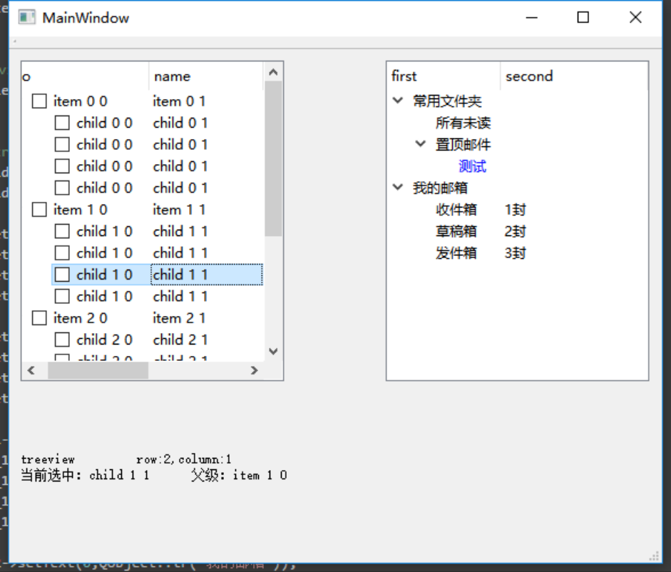
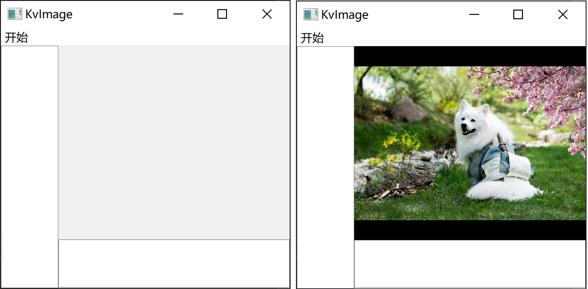
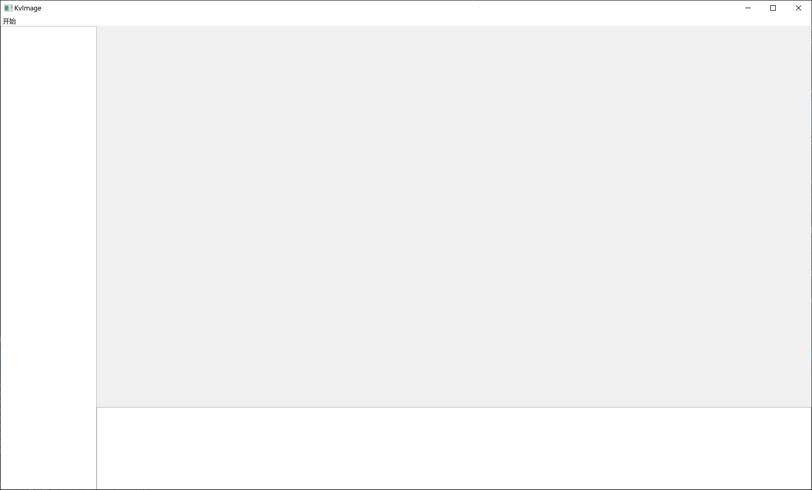
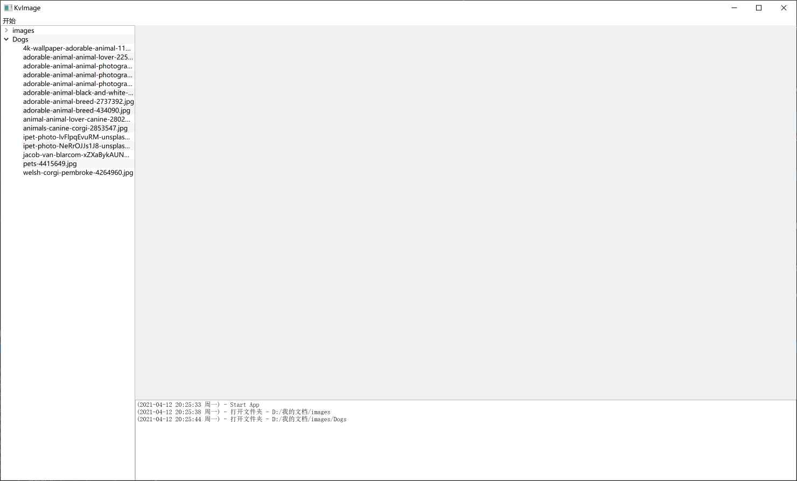

# 从1到2：图像浏览软件的优化与改进

> date: 2021-04-12 22:22:53
>
> 在之前的设计中，我们直接在centralWidget中拖了一个QLabel作为显示图像的控件，所有的事件是基于主窗体的。当我们需要加入一些额外的窗体控件时，比如说底部的信息栏，侧边栏列表，就会想到要将几个部分分开来，保持其独立性。这篇文章记录了图片浏览软件优化的过程，为后续将其升级成图片处理软件做准备。包括一些控件的封装、设计、组件通信的内容。


# 把图片窗口封装成一个控件

首先把centralWidget中的label控件删除，接着在工程中创建一个类，命名为`ImageViewer`，基类是`QWidget`。然后将图像显示、鼠标事件、调整尺寸事件的函数以及相关的成员变量移动过来（并根据报错信息进行一定的修改），如下所示：

```c++
// ImageViewer.h
#pragma once
#include <QWidget>
#include <opencv2/opencv.hpp>
#include <QLabel>
#include <QResizeEvent>
#include <QWheelEvent>
#include <QMouseEvent>

#include "Transform.h"

class ImageViewer :
    public QWidget
{
public:
	ImageViewer(QWidget* parent = Q_NULLPTR);
	void showImage(const cv::Mat& img);
	void showImage(const cv::Mat& img, cv::Rect imgRect);

protected:
	void resizeEvent(QResizeEvent* evt);
	void wheelEvent(QWheelEvent* evt);
	void mouseDoubleClickEvent(QMouseEvent* evt);
	void mousePressEvent(QMouseEvent* evt);
	void mouseMoveEvent(QMouseEvent* evt);
	void mouseReleaseEvent(QMouseEvent* evt);

private:
	QLabel* mLabel;
	cv::Mat mImg;
	cv::Rect mRect;

	// mouse start x,y; mouse end x,y
	double msX, msY, meX, meY;
};
```

由于之前的QLabel是通过拖动添加，直接通过`ui`变量可以获取，而改动后该变量无法直接获取，因此需要采用代码的方式添加（当然通过参数传递进来也可以，但是那样就显得很蠢）。将构造函数中的和QLabel相关的语句进行如下修改：

```c++
// 修改前
QString mainLabelName("main_label");
this->mLabel = ui.centralWidget->findChild<QLabel*>(mainLabelName);
if (!this->mLabel)
{
    qFatal(QString("QLabel [%1] not found!").arg(mainLabelName).toLocal8Bit());
}

// 修改后
this->mLabel = new QLabel(this);
```

尺寸调整事件：不需要考虑到其他窗口控件，只需要占满当前控件即可。

```c++
// 修改前
void ImageViewer::resizeEvent(QResizeEvent* evt)
{
    // ...
	QSize winSize = this->size(),
		menuSize = ui.menuBar->size(),
		statusSize = ui.statusBar->size();

	int labelHeight = winSize.height() - menuSize.height() - statusSize.height(),
		labelWidth = winSize.width();
	// ...
}
// 修改后
void ImageViewer::resizeEvent(QResizeEvent* evt)
{
    // ...
	QSize winSize = this->size();

	int labelHeight = winSize.height(),
		labelWidth = winSize.width();
	// ...
}
```

添加两个函数接口，用于打开图片：

```c++
// ImageViewer.h
void openImage(const cv::Mat& img);
void openImage(QString imagePath);
// ImageViewer.cpp
void ImageViewer::openImage(const cv::Mat& img)
{
	if (!img.data)
	{
		qWarning() << "ImageViewer::openImage - Mat is Empty";
		return;
	}

	this->mImg = img.clone();
	qInfo() << QString::fromLocal8Bit("ImageViewer::openImage - 图像尺寸：width=%1px, height=%2px")
		.arg(this->mImg.cols)
		.arg(this->mImg.rows);

	// 计算图片矩形
	this->mRect = Transform::calcImageRect(this->mImg, cv::Size(this->mLabel->width(), this->mLabel->height()));

	// 显示图像
	this->showImage(this->mImg, this->mRect);
}

void ImageViewer::openImage(QString imagePath)
{
	qInfo() << QString::fromLocal8Bit("ImageViewer::openImage - 打开图像 (%1)").arg(imagePath);
	this->mImg = cv::imread(imagePath.toLocal8Bit().toStdString());
	if (!this->mImg.data)
	{
		qWarning() << QString("ImageViewer::openImage - Read image failed! [%1]")
			.arg(imagePath);
		return;
	}
	qInfo() << QString::fromLocal8Bit("ImageViewer::openImage - 图像尺寸：width=%1px, height=%2px")
		.arg(this->mImg.cols)
		.arg(this->mImg.rows);

	// 计算图片矩形
	this->mRect = Transform::calcImageRect(this->mImg, cv::Size(this->mLabel->width(), this->mLabel->height()));

	// 显示图像
	this->showImage(this->mImg, this->mRect);
}
```

# 布局设计

计划在软件主界面设置三个控件：图片窗口，侧边栏，信息栏，通过纯代码的方式添加。添加时使用`new`进行初始化，初始化时将父组件作为参数传入，即可实现添加子组件的效果。这些控件的显示、位置、大小全部通过变量控制。

## 图片显示窗口控件

首先在窗体类的头文件中引入我们自建的类`#include "ImageViewer.h"`，接着添加成员变量`ImageViewer* iViewer;`

初始化成员变量并添加到中心控件的布局中

```c++
// KvImage::KvImage
this->iViewer = new ImageViewer(ui.centralWidget);    // 图片显示窗口
```

修改打开图像事件的响应函数：

```c++
void KvImage::on_action_open_image_triggered()
{
	// 通过对话框获取文件路径
	QString caption = QString::fromLocal8Bit("选择一个文件打开");
	QString dir = "";  // 为空默认记忆上一次打开的路径
	QString filter("Image (*.png *.jpg *.jpeg *.tif *.bmp)");
	QString fileName = QFileDialog::getOpenFileName(
		this, caption, dir, filter
	);

	if (fileName.isEmpty())
	{
		qWarning() << QString::fromLocal8Bit("KvImage::on_action_open_image_triggered - 未选择图片路径");
		return;
	}

	this->iViewer->openImage(fileName);
}
```


## 选择侧边栏和信息栏的控件

### 侧边栏：QTreeView还是QTreeWidget?

参考自：[doingself.github.io](https://doingself.github.io/2016/10/11/2016-10-11-QTreeVirew%E4%B8%8EQTreeWidget%E7%AE%80%E5%8D%95%E4%BD%BF%E7%94%A8/)

QTreeWidget是QTreeView的子类。Qt中QTreeWidget比QTreeView更简单，但没有QTreeView那么灵活（QTreeWidget封装的和MFC的CTreeCtrl很类似，没有mvc的特点）。



因此决定使用QTreeView，在`KvImage.h`中创建成员变量：

```c++
QTreeView* mSideBar;
```

初始化：

```c++
// KvImage::KvImage
this->mSideBar = new QTreeView(ui.centralWidget);     // 侧边栏
```


### 信息栏

信息栏使用`QTextBrowser`，继承自`QTextEdit`：

```c++
QTextBrowser* mInfoBar;
```

初始化

```c++
// KvImage::KvImage
this->mInfoBar = new QTextBrowser(ui.centralWidget);  // 信息栏
```

## 动态调整控件位置大小

布局设计的思路是：侧边栏占左侧，高度与中心控件一至，信息栏占底部，宽度为中心控件减去侧边栏的宽度，其余部分为图片窗口。

在窗体类中添加变量用来记录各个控件的位置和大小：

```c++
// 是否可见
bool sideBarVisible,
	infoBarVisible;
// 尺寸比例
int sideBarWidth,
	infoBarHeight;
```

在构造函数中初始化变量：

```c++
// 初始化变量
this->infoBarVisible = this->sideBarVisible = true;
this->sideBarWidth = 100;
this->infoBarHeight = 100;
```

设置成员函数来控制控件尺寸：

```c++
void KvImage::refreshLayout()
{
	qDebug() << "KvImage::refreshLayout()";

	// 获取中心控件的宽高
	QSize cSize = ui.centralWidget->size();
	int cw, ch;
	cw = cSize.width();
	ch = cSize.height();

	// 计算各个控件的矩形
	QRect imgRect,
		sideRect,
		infoRect;

	// 设置侧边栏
	sideRect.setX(0); sideRect.setY(0);
	sideRect.setWidth(this->sideBarVisible ? this->sideBarWidth : 0);
	sideRect.setHeight(ch);

	// 设置底部信息栏
	infoRect.setX(sideRect.width());
	if (this->infoBarVisible)
	{
		infoRect.setY(ch - this->infoBarHeight);
		infoRect.setHeight(ch * this->infoBarHeight);
	}
	else
	{
		infoRect.setY(ch);
		infoRect.setHeight(0);
	}
	infoRect.setWidth(cw - sideRect.width());

	// 设置图片区域
	imgRect.setX(sideRect.width());
	imgRect.setY(0);
	imgRect.setWidth(cw - sideRect.width());
	imgRect.setHeight(ch - infoRect.height());

	// 应用矩形位置
	this->iViewer->setGeometry(imgRect);
	this->mInfoBar->setGeometry(infoRect);
	this->iViewer->setGeometry(imgRect);
}
```

修改调整尺寸事件的函数：

```c++
void KvImage::resizeEvent(QResizeEvent* evt)
{
	this->refreshLayout();
}
```

在初始化各控件之后，更新布局：

```c++
KvImage::KvImage(QWidget* parent)
	: QMainWindow(parent)
{
	// ...
	this->refreshLayout();
}
```

运行程序，可以看到效果：



## 窗口大小随屏幕分辨率变化

由于窗口控件数值一开始写死，在遇到不同分辨率屏幕时显示效果不一致。希望通过初始化窗口时屏幕的分辨率来设定窗口尺寸，例如占宽60，占高80这样，因此需要首先获取到屏幕的实际宽高，再相应地调整整个窗体的尺寸，以及各个控件的尺寸。

```c++
// 设置窗体大小
QDesktopWidget* desktopWidget = QApplication::desktop();
QRect deskRect = desktopWidget->availableGeometry();  // 可用桌面大小
int deskHeight, deskWidth;
deskHeight = deskRect.height();
deskWidth = deskRect.width();
int winHeight, winWidth;
winHeight = deskHeight * 0.8;
winWidth = deskWidth * 0.8;
this->setGeometry(deskWidth / 2 - winWidth / 2, deskHeight / 2 - winHeight / 2, winWidth, winHeight);

// 初始化变量
this->infoBarVisible = this->sideBarVisible = true;
this->sideBarWidth = winWidth * 0.2;
this->infoBarHeight = winHeight * 0.2;
this->sideBarWidth = this->sideBarWidth > 350 ? 350 : this->sideBarWidth;
this->infoBarHeight = this->infoBarHeight > 300 ? 300 : this->infoBarHeight;
```

这样初始化时就可控多了，调了一个相对舒适的布局：



# 侧边栏

> 官方文档：[QTreeView](https://doc.qt.io/qt-5.12/qtreeview.html)
>
> 使用总结：[QTreeView使用总结--序](https://blog.csdn.net/dpsying/article/details/79687254)

侧边栏`QTreeView`的基础设置和内容填充可以参考以下的代码（from [blog.csdn.net/dpsying](https://blog.csdn.net/dpsying/article/details/79688791)）

```c++
//////
//1，QTreeView常用设置项
this->mSideBar->setEditTriggers(QTreeView::NoEditTriggers);   //单元格不能编辑
this->mSideBar->setSelectionBehavior(QTreeView::SelectRows);  //一次选中整行
this->mSideBar->setSelectionMode(QTreeView::SingleSelection); //单选，配合上面的整行就是一次选单行
this->mSideBar->setAlternatingRowColors(true);                //每间隔一行颜色不一样，当有qss时该属性无效
this->mSideBar->setFocusPolicy(Qt::NoFocus);                  //去掉鼠标移到单元格上时的虚线框

//2，列头相关设置
this->mSideBar->header()->hide();                                 //隐藏列头
// this->mSideBar->header()->setStretchLastSection(true);            //最后一列自适应宽度
// this->mSideBar->header()->setDefaultAlignment(Qt::AlignCenter);   //列头文字默认居中对齐

//3，构造Model
QStandardItemModel* model = new QStandardItemModel(this->mSideBar);
// model->setHorizontalHeaderLabels(QStringList() << QStringLiteral("序号") << QStringLiteral("名称"));     //设置列头
for (int i = 0; i < 5; i++)
{
	//一级节点，加入mModel
	QList<QStandardItem*> items1;
	QStandardItem* item1 = new QStandardItem(QString::number(i));
	QStandardItem* item2 = new QStandardItem(QStringLiteral("一级节点"));
	items1.append(item1);
	items1.append(item2);
	model->appendRow(items1);

	for (int j = 0; j < 5; j++)
	{
		//二级节点,加入第1个一级节点
		QList<QStandardItem*> items2;
		QStandardItem* item3 = new QStandardItem(QString::number(j));
		QStandardItem* item4 = new QStandardItem(QStringLiteral("二级节点"));
		items2.append(item3);
		items2.append(item4);
		item1->appendRow(items2);

		for (int k = 0; k < 5; k++)
		{
			//三级节点,加入第1个二级节点
			QList<QStandardItem*> items3;
			QStandardItem* item5 = new QStandardItem(QString::number(k));
			QStandardItem* item6 = new QStandardItem(QStringLiteral("三级节点"));
			items3.append(item5);
			items3.append(item6);
			item3->appendRow(items3);
		}
	}
}

//4，应用model
this->mSideBar->setModel(model);

//一些项在应用model后设置
//5，设第一列初始宽度；第一列固定宽度
this->mSideBar->header()->resizeSection(0, 100);
this->mSideBar->header()->setSectionResizeMode(0, QHeaderView::Fixed);
//6，默认选中一级节点的第一行
QModelIndex rootIndex = this->mSideBar->rootIndex();
QModelIndex selIndex = model->index(0, 0, rootIndex);
this->mSideBar->setCurrentIndex(selIndex);
```

侧边栏的内容可以看作是一个表格，也有行列的概念。

## 初始化侧边栏

侧边栏包含两个对象：视图和模型。因此需要通过两个变量来管理，由于在之前定义好了视图变量`mSideBar`，因此在这部分补充另一个变量`mSideBarModel`。

```c++
QTreeView* mSideBar;
QStandardItemModel* mSideBarModel;
```

创建成员函数`initSidebar()`来初始化侧边栏：

```c++
void KvImage::initSidebar()
{
	// 侧边栏 单元格属性设置
	this->mSideBar->setEditTriggers(QTreeView::NoEditTriggers);   //单元格不能编辑
	this->mSideBar->setSelectionBehavior(QTreeView::SelectRows);  //一次选中整行
	this->mSideBar->setSelectionMode(QTreeView::SingleSelection); //单选，配合上面的整行就是一次选单行
	this->mSideBar->setAlternatingRowColors(true);                //每间隔一行颜色不一样，当有qss时该属性无效
	this->mSideBar->setFocusPolicy(Qt::NoFocus);                  //去掉鼠标移到单元格上时的虚线框
	this->mSideBar->header()->hide();

	// 初始化侧边栏模型
	this->mSideBarModel = new QStandardItemModel(this->mSideBar);
	
	// 应用模型
	this->mSideBar->setModel(this->mSideBarModel);
}
```


## 显示文件夹下所有图片

创建一个类`ImageDir`用来存放文件夹名称及图片路径，同时暴露一些函数接口用于获取图片数量、图片信息：

ImageDir.h

```c++
#pragma once
#include <QDir>
#include <QString>
#include <QStringList>
#include <QFileInfoList>
#include <QList>

class ImageDir
{
	ImageDir(QString dirPath, QStringList filters = { "*.jpg", "*.png", "*.jpeg", "*.tif", "*.bmp" });

	QList<QString> getImageNameList();
	QList<QString> getImagePathList();
	int imageNum();
	QString dirPath();
	QString dirName();

private:
	QString mDirPath;
	QFileInfoList mImageList;
};
```

ImageDir.cpp

```c++
#include "ImageDir.h"

ImageDir::ImageDir(QString dirPath, QStringList filters)
{
	this->mDirPath = dirPath;

	QDir* dir = new QDir(dirPath);
	this->mImageList = dir->entryInfoList(filters);
}

QList<QString> ImageDir::getImageNameList()
{
	if (this->mDirPath.isEmpty() || this->mImageList.isEmpty())
	{
		return QList<QString>();
	}

	QList<QString> nameList;
	for (int i = 0; i < this->mImageList.size(); i++)
	{
		nameList << this->mImageList.at(i).fileName();
	}
	return nameList;
}

QList<QString> ImageDir::getImagePathList()
{
	if (this->mDirPath.isEmpty() || this->mImageList.isEmpty())
	{
		return QList<QString>();
	}

	QList<QString> pathList;
	for (int i = 0; i < this->mImageList.size(); i++)
	{
		pathList << this->mImageList.at(i).absoluteFilePath();
	}
	return pathList;
}

int ImageDir::imageNum()
{
	if (this->mDirPath.isEmpty() || this->mImageList.isEmpty())
	{
		return 0;
	}

	return this->mImageList.size();
}

QString ImageDir::dirPath()
{
	return this->mDirPath;
}

QString ImageDir::dirName()
{
	QStringList dirPathSplitList = this->mDirPath.split("/");
	if (dirPathSplitList.size() == 0)
	{
		return QString();
	}

	return dirPathSplitList.last();
}
```

在KvImage.cpp中引入`ImageDir`类（`#include "ImageDir.h"`），并添加变量存放图像文件夹（`QList<ImageDir> mImgDirList;`）

在Qt Designer中添加动作`action_open_directory`，打开文件夹。在`KvImage`类中添加其响应函数：

```c++
void KvImage::on_action_open_directory_triggered()
{
	QString dirPath = QFileDialog::getExistingDirectory(this,
		QString::fromLocal8Bit("打开文件夹"));

	if (dirPath.isEmpty())
	{
		qWarning() << QString::fromLocal8Bit("KvImage::on_action_open_directory_triggered() - 未选择文件夹");
		return;
	}

	for (int i = 0; i < this->mImgDirList.size(); i++)
	{
		if (dirPath == this->mImgDirList[i].dirPath())
		{
			qWarning() << QString::fromLocal8Bit("%1 已打开").arg(dirPath);
			return;
		}
	}

	this->mImgDirList.append(ImageDir(dirPath));
}
```

添加函数`refreshSidebar`，根据成员变量`mImgDirList`刷新侧边栏：

```c++
void KvImage::refreshSidebar(QList<ImageDir>& imgDirList)
{
	if (!this->mSideBarModel)
	{
		this->initSidebar();
	}

	// 添加数据
	int i;
	for (i = 0; i < imgDirList.size(); i++)
	{
		QStandardItem* dirItem = new QStandardItem(imgDirList[i].dirName());
		this->mSideBarModel->appendRow(dirItem);

		QStringList imgNameList = imgDirList[i].getImageNameList();
		for (int j = 0; j < imgNameList.size(); j++)
		{
			dirItem->appendRow(new QStandardItem(imgNameList.at(j)));
		}
	}

	// 展开最新添加的一行
	QModelIndex rootIndex = this->mSideBar->rootIndex();
	QModelIndex lastRowIndex = this->mSideBarModel->index(i - 1, 0, rootIndex);
	this->mSideBar->expand(lastRowIndex);
}
```

其中，通过`rootIndex()`获取到根节点的索引，再根据根节点从模型中计算出位于`i-1`行`0`列的索引，即最新打开的文件夹索引，将其自动展开。

最后在打开文件夹的响应函数最后添加上如下代码，即可实现打开文件夹显示其所有图像文件到侧边栏的功能了。

```c++
void KvImage::on_action_open_directory_triggered()
{
	// ...
	this->mImgDirList.append(ImageDir(dirPath));

	this->refreshSidebar(this->mImgDirList);
	this->putText(QString::fromLocal8Bit("打开文件夹 - %1").arg(dirPath));
}
```



## 侧边栏的点击事件

> [QTreeView使用总结5，选中信号处理](https://blog.csdn.net/dpsying/article/details/80072916)

将图片文件夹加载进来，下一步希望的是点击图片列表的名称后，自动在图片窗口中显示图片。QTreeView的内容由[QItemSelectionModel](https://doc.qt.io/qt-5.12/qitemselectionmodel.html)管理，通过接口函数[selectionModel()](https://doc.qt.io/qt-5.12/qabstractitemview.html#selectionModel)可以获得这个对象的指针。该对象提供了一些[信号](https://doc.qt.io/qt-5.12/qitemselectionmodel.html#signals)：

```c++
void currentChanged(const QModelIndex &current, const QModelIndex &previous)
void currentColumnChanged(const QModelIndex &current, const QModelIndex &previous)
void currentRowChanged(const QModelIndex &current, const QModelIndex &previous)
void modelChanged(QAbstractItemModel *model)
void selectionChanged(const QItemSelection &selected, const QItemSelection &deselected)
```

其中，`currentChanged`处理单个元素，区分行列；`currentColumnChanged`仅区分列；`currentRowChanged`仅区分行；`selectionChanged`可以处理多选的情况。在图片列表中，一个图片占一行，因此用`currentRowChanged`即可满足需求。

设定处理选中的槽函数：

```c++
void onImageSelectChanged(const QModelIndex& curIdx, const QModelIndex& preIdx);
```

绑定信号和槽：

```c++
KvImage::KvImage(QWidget* parent) : QMainWindow(parent)
{
	// ...
	// 绑定信号和槽
	connect(this->mSideBar->selectionModel(), &QItemSelectionModel::currentRowChanged, this, &KvImage::onImageSelectChanged);
}
```

在槽函数中，根据传回来的行信号取得图片信息，再查询图片文件夹列表获取图片的完整路径，最后调用`iViewer->openImage()`打开图像并显示。槽函数的实现如下所示：

```c++
void KvImage::onImageSelectChanged(const QModelIndex& curIdx, const QModelIndex& preIdx)
{
	// 如果没有父节点，说明是根节点
	QModelIndex parentIdx = curIdx.parent();
	if (!parentIdx.isValid())
	{
		return;
	}

	// 获取图片路径
	QStandardItem* item = ((QStandardItemModel*)this->mSideBar->model())->itemFromIndex(curIdx);
	QString imgPath = QString("%1/%2")
		.arg(this->mImgDirList[parentIdx.row()].dirPath())
		.arg(item->text());
	
	qDebug() << QString::fromLocal8Bit("KvImage::onImageSelectChanged() - 选择图像: %1")
		.arg(imgPath);
	this->iViewer->openImage(imgPath);
}
```

# 底部信息栏

底部信息栏用的是`QTextBrowser`，其实主要调用的接口都继承于`QTextEdit`，用哪一个都行，在这里作为文字输出控件来说没太大影响。

在窗体的构造函数中设置信息栏允许打开外部链接：在输出HTML文本的a标签时，可以直接打开（不过暂不支持链接包含中文，考虑自己写一个类来覆盖原有事件[anchorClicked](https://doc.qt.io/qt-5.12/qtextbrowser.html#anchorClicked)）

```c++
this->mInfoBar->setOpenExternalLinks(true);
```

在打开图像按钮事件函数中添加输出到信息栏的功能：

```c++
void KvImage::on_action_open_image_triggered()
{
	// ...
	this->iViewer->openImage(fileName);
	this->mInfoBar->textCursor().insertText(
		QString::fromLocal8Bit("打开图像：%1\n").arg(fileName));
}
```

添加文字通过操作`QTextBrowser`的`textCursor`来实现，[文档](https://doc.qt.io/qt-5.12/qtextcursor.html)。

甚至可以直接插入图像：

```c++
this->mInfoBar->textCursor().insertImage(fileName);
```

还是很不错的！

封装成一个函数：

```c++
void KvImage::putText(QString txt)
{
	if (!this->mInfoBar) return;

	QString logStr = QString("(%1) - %2\n")
		.arg(QDateTime::currentDateTime().toString("yyyy-MM-dd hh:mm:ss ddd"))  // 时间
		.arg(txt);  // 消息内容

	this->mInfoBar->textCursor().insertText(logStr);
}
```
